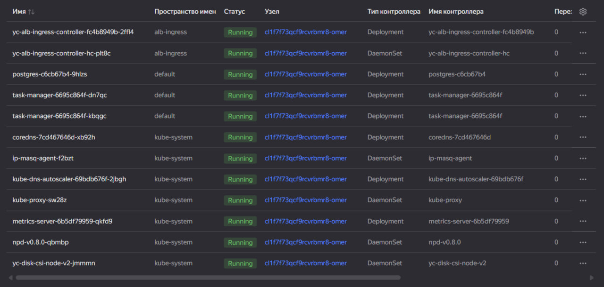
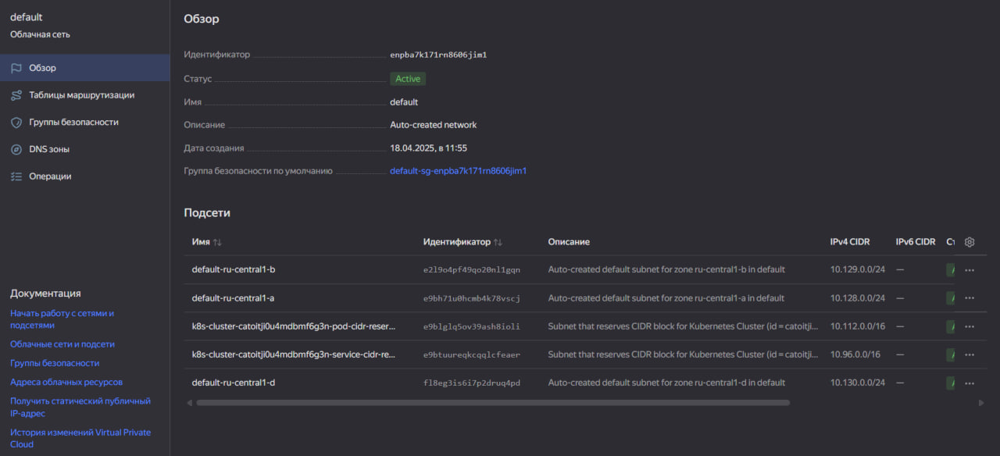
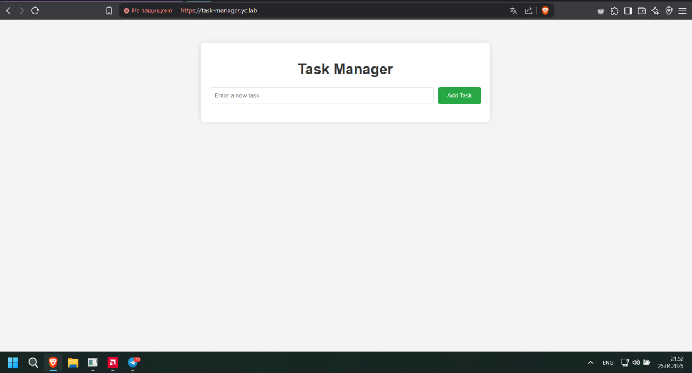
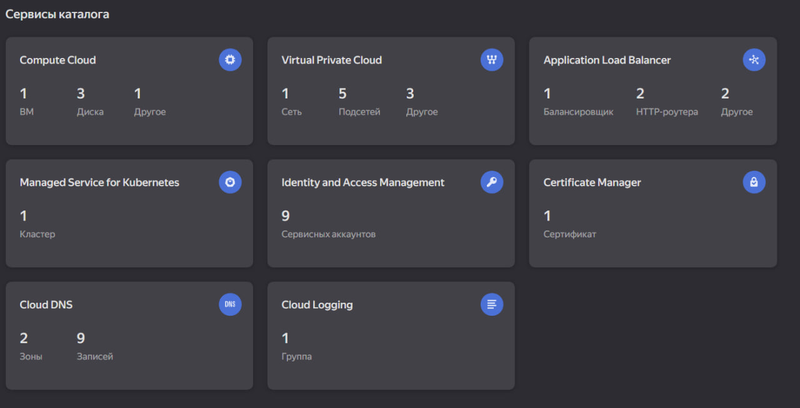

# Отчет по Практической Работе: Развертывание Веб-Приложения Task Manager в Yandex Managed Kubernetes с использованием ALB Ingress Controller и TLS

## 1. Введение

Данная работа посвящена развертыванию веб-приложения "Task Manager", состоящего из frontend-части и базы данных PostgreSQL, в кластере Yandex Managed Kubernetes. Целью является обеспечение безопасного публичного доступа к приложению через HTTPS с использованием Ingress-ресурса Kubernetes, контроллера Yandex Application Load Balancer (ALB) Ingress Controller и TLS-сертификата, управляемого через Yandex Certificate Manager.

## 2. Цель Работы

*   Развернуть приложение Task Manager и базу данных PostgreSQL в кластере Yandex MKS.
*   Установить и настроить Yandex ALB Ingress Controller.
*   Создать и добавить TLS-сертификат в Yandex Certificate Manager.
*   Настроить Ingress-ресурс для маршрутизации трафика к приложению Task Manager с использованием HTTPS.
*   Обеспечить доступ к приложению по заданному DNS-имени через созданный Application Load Balancer.

## 3. Используемое ПО и Сервисы

*   **Оркестрация:** Yandex Managed Kubernetes (MKS)
*   **Балансировка:** Yandex Application Load Balancer (ALB) Ingress Controller
*   **Сертификаты:** Yandex Certificate Manager
*   **Сеть:** Yandex Virtual Private Cloud (VPC)
*   **Контейнеризация:** Docker (собственноручный созданный образ `wede365/task-manager:latest`, образ `postgres:latest`)
*   **Инструменты:** `kubectl`, `yc` (Yandex Cloud CLI), `openssl`

## 4. Предварительные Требования

*   Созданный и настроенный кластер Yandex Managed Kubernetes.
*   Установленный и настроенный `kubectl` для взаимодействия с кластером.
*   Установленный и настроенный `yc` CLI для взаимодействия с Yandex Cloud.
*   Установленный Yandex ALB Ingress Controller в кластере.
*   Наличие сервисного аккаунта (либо аккаунта группы узлов, либо выделенного для контроллера) с необходимыми IAM-ролями (`alb.editor`, `vpc.publicAdmin`, `certificate-manager.certificates.downloader`).

## 5. Ход Работы

### 5.1. Подготовка TLS-сертификата

Для обеспечения HTTPS-соединения был создан самоподписанный TLS-сертификат для тестового доменного имени `task-manager.yc.lab` с помощью OpenSSL:

```bash
openssl req -x509 -newkey rsa:4096 -nodes \
  -keyout key.pem \
  -out cert.pem \
  -days 365 \
  -subj '/CN=task-manager.yc.lab'
```
### 5.2. Загрузка сертификата в Yandex Certificate Manager
Созданные файлы сертификата (cert.pem) и приватного ключа (key.pem) были загружены в Yandex Certificate Manager с помощью yc CLI:
```
yc certificate-manager certificate create \
  --name task-manager-cert \
  --chain cert.pem \
  --key key.pem
```
Был получен и сохранен ID созданного сертификата для дальнейшего использования в Ingress-манифесте.

### 5.3. Подготовка Kubernetes Манифестов
Были подготовлены следующие манифесты Kubernetes в директории k8s/:

*   **secret.yaml**: Для хранения учетных данных PostgreSQL.
*   **deployment.yaml**: Для развертывания подов PostgreSQL и Task Manager.
*   **service.yaml**: Для создания служб (Services) PostgreSQL (тип ClusterIP) и Task Manager (тип NodePort).
*   **ingress.yaml**: Для настройки Ingress-ресурса.

### 5.4. Развертывание Базы Данных и Приложения
Сначала был создан секрет для пароля PostgreSQL:
```
kubectl apply -f k8s/secret.yaml
```
Затем были развернуты Deployment и Service для PostgreSQL и Task Manager:
```
kubectl apply -f k8s/deployment.yaml
kubectl apply -f k8s/service.yaml
```
Статус подов и эндпоинтов сервиса task-manager проверялся командами kubectl get pods -l app=... и kubectl get endpoints task-manager до достижения ими состояния Running и READY 1/1.

Важное замечание: Изначально сервис task-manager был создан с типом ClusterIP, что привело к ошибкам при настройке Ingress. Тип сервиса был исправлен на NodePort для корректной работы с Yandex ALB Ingress Controller.

### 5.5. Настройка и Развертывание Ingress
Был создан и применен манифест k8s/ingress.yaml для настройки правил маршрутизации и TLS:
```
kubectl apply -f k8s/ingress.yaml
```


### 5.6. Проверка статуса Ingress
Статус создания Application Load Balancer и получения внешнего IP-адреса отслеживался командой:
```
kubectl get ingress task-manager-ingress-tls -n default -w
```
Процесс занял около 10-15 минут, после чего в поле ADDRESS появился публичный IP-адрес.


### 5.7. Настройка Доступа и Проверка
Для доступа к приложению по доменному имени task-manager.yc.lab была добавлена запись в файл hosts на собственном ПК:

<ALB_IP_ADDRESS> task-manager.yc.lab
Где <ALB_IP_ADDRESS> - IP-адрес, полученный Ingress.

После этого был выполнен переход по адресу https://task-manager.yc.lab в браузере. Было принято предупреждение безопасности (из-за самоподписанного сертификата), после чего открылся интерфейс приложения Task Manager.


## 6. Основные Проблемы и Решения в ходе работы

*   **Ошибка**: Поды task-manager не запускались с ошибкой secret "postgres-creds" not found. Решение: Был создан необходимый секрет Kubernetes командой kubectl create secret generic postgres-creds --from-literal=db-password='...'.
*   **Ошибка**: Ingress task-manager-ingress (первоначальная версия без TLS) не получал ADDRESS, в логах контроллера не было ошибок. Решение: Многократная проверка IAM-ролей сервисного аккаунта группы узлов (alb.editor, vpc.publicAdmin, compute.viewer, certificate-manager.certificates.downloader), проверка аннотаций Ingress, проверка здоровья подов task-manager.
*   **Ошибка**: В событиях Ingress (kubectl describe ingress) появилась ошибка failed to find port for service: task-manager. Решение: Проверка определения Service task-manager. Порт 80 был объявлен корректно, что указывало на другую проблему.
*   **Ошибка**: В логах контроллера ALB обнаружена ошибка type of service task-manager/default used by path is not NodePort. Решение: Ключевая проблема. Тип сервиса task-manager был изменен с ClusterIP на NodePort в файле k8s/service.yaml и применен командой kubectl apply. После исправления типа сервиса в событиях Ingress появились сообщения resource ... not ready и operation ... is still in progress. Решение: Ожидание (10-20 минут) завершения создания ресурсов Application Load Balancer в Yandex Cloud.

## 7. Результат
Приложение Task Manager было успешно развернуто в кластере Yandex Managed Kubernetes. Настроен безопасный публичный доступ к приложению по адресу https://task-manager.yc.lab через Yandex Application Load Balancer с использованием TLS-шифрования на основе сертификата из Yandex Certificate Manager. Маршрутизация трафика осуществляется с помощью Ingress-ресурса Kubernetes.


## 8. Вывод
В ходе выполнения практической работы были освоены навыки развертывания многокомпонентных приложений в Kubernetes, настройки сетевого доступа с использованием Ingress-контроллера Yandex ALB, интеграции с Yandex Certificate Manager для обеспечения TLS, а также методы диагностики и устранения типичных проблем при настройке Ingress в Yandex Cloud. Было продемонстрировано требование Yandex ALB Ingress Controller к использованию сервисов типа NodePort в качестве бэкендов.
